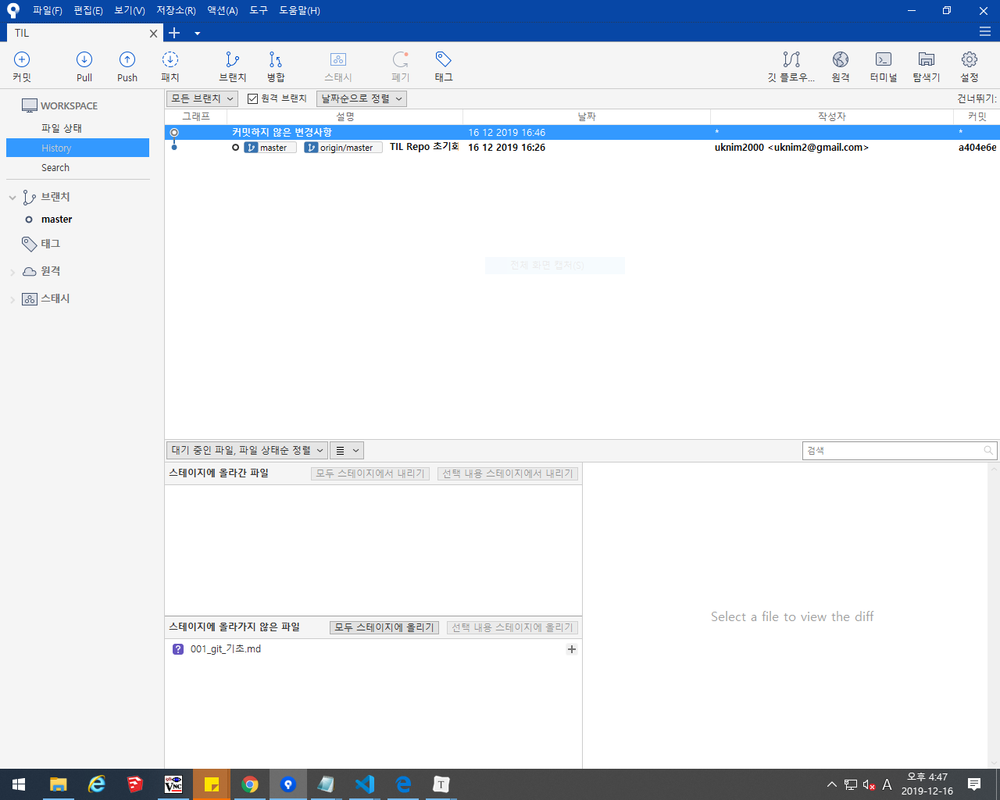

# Git 기초

## 개념

### SCM이란?

Sourc Code Manager의 약자로, 코드의 버전을 관리하기 위해 존재한다.

### Git

git은 Linus Torvalds가 만든 SCM으로, 현재 가장 많이 사용하게된다.

### Github

sithub는 git이 관리하는 Repo의 원격 저장소를 제공하는 서비스다. 가장 많이 사용하여 오픈소스 프로젝트들이 성장하는 곳이다. 최근MS에 인수되었다.

### Screenshot

